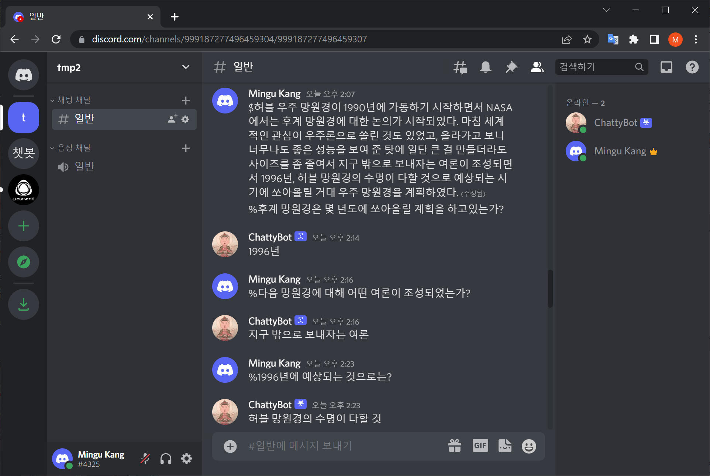

## How to Build a Discord Question Answering Chatbot





## Getting Started

[1](https://github.com/minqukanq/discord-chatbo-t5/tree/main/train_model/data). Gather text data or make custom datsets

   1. In this implementation, I used the KorQuAD 1.0 dataset

[2](https://github.com/minqukanq/discord-chatbo-t5/blob/main/train_model/train.py). Train the T5 model

[3](https://github.com/minqukanq/discord-chatbo-t5/blob/main/deploy_model/deploy.py). Deploy the model to Hugging Face

[4](https://github.com/minqukanq/discord-chatbo-t5/blob/main/build_discord_bot/bot.py). Build a Discord bot

[5](https://discord.com/developers/applications). Set up the Discord bot's permission

   1. Join https://discord.com/developers/applications
   2. New Application
   3. OAuth2 --> URL Generator --> Select "bot" and "Send Messages"
   4. Copy GENERATED URL and paste
   5. Join your server

6. Host the bot

   ``` python
   python build_discord_bot/bot.py
   ```


## Author

* Mingu Kang - [Github](https://github.com/minqukanq)
